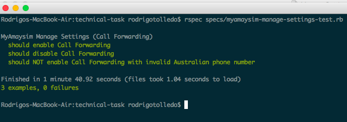

# Technical Task

Technical task developed by Rodrigo Tolledo.

## Getting Started
Clone this repository:

```
git clone https://github.com/rodrigotolledo/technical-task.git
```

## Prerequisites

You will need a MAC machine with Ruby, Selenium-WebDriver, RSpec and Chrome installed.

The project was developed and tested with the following versions:

```
ruby (2.2.0p0)
selenium-webdriver (3.3.0)
rspec (3.5.0)
Chrome 56.0.2924.87 (64-bit)
```
ps: It may work with different versions though.

## Installation
You can install Ruby with the following command:

```
brew install ruby
```
ps: You will need [homebrew](https://brew.sh/) installed on your machine.


You can install Selenium-WebDriver and RSpec with the following commands:

```
gem install selenium-webdriver
gem install rspec
```

## Project structure
`driver` - Contains ChromeDriver which is used by Selenium-WebDriver to run the tests.

`pages` - Pages elements and methods to interact with application.

`specs` - Tests are located here.

## Running the tests
To run the tests, simply run the following command (from the main project directory):

```
rspec specs/myamaysim-manage-settings-test.rb
```

Your browser will open and tests will be executed. Once tests are finished, you should see the following results in your console:

	
## Further improvements
There are a few `sleep`'s in the code which ideally should be replaced by `wait.until` to improve test robustness.

Having a `Gemfile` with the specific gem versions (selenium-webdriver, rspec and ruby) would make the setup easier.